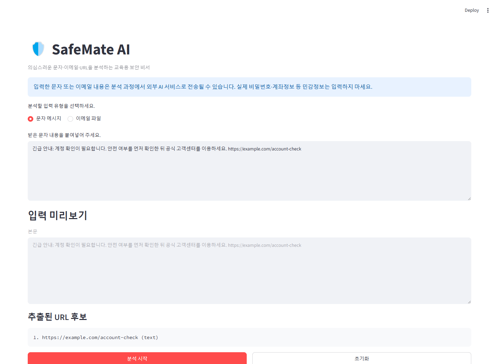
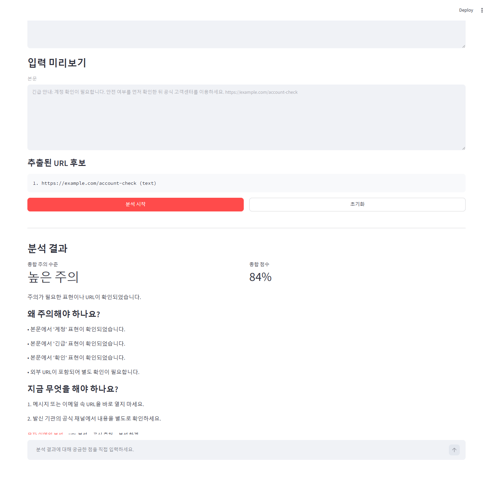
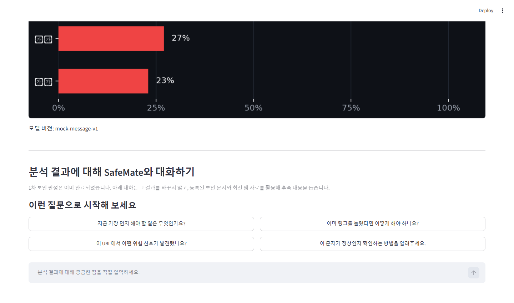

# SafeMate AI

SafeMate AI는 의심스러운 문자 메시지와 `.eml` 이메일을 입력받아 위험 신호를 정리하고, 사용자가 취할 수 있는 대응 방법을 안내하는 Streamlit 기반 교육용 보안 도구입니다.

Streamlit UI의 1차 분석은 저장소에 포함된 로컬 문자·이메일·URL 모델을 직접 호출합니다. 결과는 위험 신호를 안내하기 위한 참고 정보이며 실제 피싱 확정 판정으로 사용하지 않습니다.

> 아래 화면 예시는 합성 입력으로 캡처한 예시이며 현재 모델 결과와 수치가 다를 수 있습니다.

## 주요 기능

- 문자 메시지 직접 입력 및 최대 길이 검증
- `.eml` 확장자, 크기, 파일 시그니처, 이메일 구조 검증과 안전한 파싱
- 본문, HTML 링크의 `href`, 이미지 `src`에서 URL 후보 추출
- 이메일 표시 URL과 실제 연결 URL의 도메인 불일치 탐지
- 로컬 문자·이메일·URL 모델 분석과 종합 주의 수준 계산
- 위험 이유, 즉시 대응 방법과 분석 한계 표시
- Matplotlib 기반 메시지 통합 점수와 URL 특징 시각화
- 1차 분석 완료 후 OpenAI 기반 보안 비서 후속 채팅

## UI 화면 미리보기

아래 화면은 합성 문자와 `example.com` URL을 사용해 캡처했습니다. 실제 개인정보나 악성 URL은 사용하지 않았습니다.

### 1. 문자 메시지 입력



### 2. 분석 결과



### 3. 후속 보안 비서 채팅



후속 채팅은 1차 분석 결과를 바꾸지 않고 대응 방법을 설명하는 별도 단계입니다. 답변 생성에는 유효한 OpenAI API 설정과 네트워크 연결이 필요합니다.

## 처리 흐름

1. 사용자가 문자 메시지를 붙여넣거나 `.eml` 파일을 업로드합니다.
2. 입력 형식과 크기를 검증하고, 이메일은 실행하거나 HTML로 렌더링하지 않은 채 헤더와 본문을 파싱합니다.
3. 본문과 이메일 속성에서 URL 후보를 추출하고 표시 URL과 실제 연결 URL의 불일치를 확인합니다. 이 과정에서 URL에 접속하지 않습니다.
4. 로컬 문자·이메일 모델과 URL 모델을 호출하고 유효한 점수 중 최댓값으로 종합 주의 수준을 계산합니다.
5. UI가 위험 이유, 대응 방법, 세부 결과, Matplotlib 그래프와 분석 한계를 표시합니다.
6. 분석이 끝나면 사용자가 결과에 대해 후속 질문을 입력할 수 있습니다. 이 대화는 1차 판정에 다시 반영되지 않습니다.

## 설치 및 실행

Python 3.11 이상을 권장합니다. 저장소 루트에서 다음 명령을 실행합니다.

### macOS / Linux

```bash
python -m venv .venv
source .venv/bin/activate
python -m pip install -r requirements.txt
streamlit run app.py
```

### Windows PowerShell

```powershell
py -m venv .venv
.\.venv\Scripts\Activate.ps1
python -m pip install -r requirements.txt
streamlit run app.py
```

실행 후 브라우저에서 기본 주소인 `http://localhost:8501`에 접속합니다.

## 환경변수

저장소 루트에 Git에서 제외되는 `.env` 파일을 만들고 필요한 값을 설정합니다.

```env
OPENAI_API_KEY=
OPENAI_MODEL=
OPENAI_VECTOR_STORE_ID=
SAFEMATE_URL_MODEL_PATH=
SAFEMATE_URL_MODEL_KIND=char
```

| 변수 | 설명 |
|---|---|
| `OPENAI_API_KEY` | 분석 후 보안 비서 채팅에서 사용할 OpenAI API 키입니다. 저장소에 커밋하지 마세요. |
| `OPENAI_MODEL` | 후속 채팅에 사용할 OpenAI 모델 이름입니다. |
| `OPENAI_VECTOR_STORE_ID` | 선택 항목입니다. 설정하면 등록된 보안 문서 검색을 후속 채팅에 사용할 수 있습니다. |
| `SAFEMATE_URL_MODEL_PATH` | 선택 항목입니다. 비어 있으면 저장소에 포함된 기본 URL 모델을 사용합니다. |
| `SAFEMATE_URL_MODEL_KIND` | URL 모델 종류입니다. 기본값은 현재 모델 산출물에 맞는 `char`입니다. |

1차 분석은 별도 백엔드 선택 없이 저장소의 로컬 문자·이메일·URL 모델을 직접 사용합니다. `OPENAI_VECTOR_STORE_ID`가 비어 있으면 후속 채팅의 File Search는 사용하지 않습니다.

## 운영 정책

- OpenAI API는 호출 시도당 60초 타임아웃을 적용하고, 일시적 오류에 한해 최대 2회 재시도합니다.
- 종합 위험 점수는 유효한 메시지 피싱 확률과 URL 위험 점수 중 최댓값입니다.
- `0.4` 미만은 `low`, `0.4` 이상 `0.7` 미만은 `medium`, `0.7` 이상은 `high`입니다.
- Web Search와 클릭 가능한 공식 출처는 코드로 검수된 국내 공공기관 HTTPS 도메인과 그 하위 도메인으로 제한합니다.

## 문자 메시지와 이메일 사용 방법

### 문자 메시지

1. 입력 유형에서 **문자 메시지**를 선택합니다.
2. 받은 내용을 URL까지 포함해 입력창에 붙여넣습니다.
3. 입력 미리보기와 추출된 URL 후보를 확인합니다.
4. **분석 시작**을 누릅니다.

문자 입력은 공백만 있는 내용과 최대 길이를 초과한 내용을 거부합니다. 테스트나 데모에는 실제 개인정보 대신 합성 데이터를 사용하고, URL은 `example.com` 또는 `example.org`를 사용하세요.

### `.eml` 이메일

1. 입력 유형에서 **이메일 파일**을 선택합니다.
2. `.eml` 파일을 업로드합니다.
3. 발신자, 수신자, 제목, 본문과 URL 후보 미리보기를 확인합니다.
4. **분석 시작**을 누릅니다.

업로드 파일은 최대 25MB이며 `.eml`만 허용됩니다. 이중 확장자, 알려진 바이너리 시그니처, 이메일 헤더와 본문 구조를 검사합니다. HTML은 브라우저에 렌더링하지 않으며 추출된 URL도 파싱 단계에서는 열지 않습니다.

## 현재 구현 상태

| 항목 | 상태 | 비고 |
|---|---|---|
| Streamlit UI | 구현 | 문자·이메일 입력, 미리보기, 결과, 후속 채팅 화면 |
| SMS 직접 입력 | 구현 | 공백 및 최대 길이 검증 포함 |
| `.eml` 검증 및 파싱 | 구현 | 확장자, 크기, 시그니처, 구조 검증 포함 |
| URL 추출 | 구현 | 본문, `href`, 이미지 `src` 대상 |
| 표시 URL과 실제 연결 URL 불일치 탐지 | 구현 | 이메일 HTML 링크의 도메인 비교 |
| 1차 분석 | 구현 | 로컬 문자·이메일·URL 모델을 직접 호출 |
| Matplotlib 시각화 | 구현 | 메시지 통합 점수와 URL 특징 시각화 |
| 분석 후 보안 비서 채팅 | 구현 | OpenAI 설정과 네트워크 필요 |
| 로컬 메시지·URL 모델 연결 | 구현 | `LocalAnalysisClient`가 공통 응답 계약으로 통합 |

모델 파일은 `models/`에 배치하며 URL 모델 경로와 종류는 선택적 환경변수로 재정의할 수 있습니다.

## 테스트

가상환경에 의존성을 설치한 뒤 저장소 루트에서 실행합니다.

```bash
python -m pytest -q
```

## 프로젝트 구조

```text
SafeMate-AI/
├── app.py                    # Streamlit 애플리케이션 진입점
├── src/
│   ├── analyzers/            # 입력·이메일 파싱과 모델 분석 진입점
│   ├── services/             # OpenAI Web/File Search 및 후속 채팅
│   ├── ui/                   # UI 컴포넌트, 로컬 분석 어댑터, 시각화
│   ├── client_factory.py     # 로컬 분석 클라이언트 구성
│   ├── contracts.py          # 공통 요청과 클라이언트 계약
│   ├── config.py             # 입력 제한과 운영 설정
│   └── pipeline.py           # 종합 위험도 계산 정책
├── models/                   # 전달된 모델 파일 배치 영역
├── docs/
│   └── images/               # README UI 캡처
├── tests/                    # 단위·UI·운영 정책 테스트
├── requirements.txt
└── README.md
```

## 문서

- [URL 위험도 분석 모듈](docs/url_analyzer.md) — 전처리, 학습·튜닝과 예측 API
- [모델–UI 연동 요구사항](docs/SafeMate_모델_UI_연동_요구사항.md)
- [분석 통합·UI 공통 계약](docs/SafeMate_분석_통합_UI_공통계약.md)

## 주의사항

SafeMate AI는 교육과 개발 검증을 위한 보조 도구입니다. 분석 결과만으로 피싱 여부나 발신자의 신뢰성을 확정할 수 없습니다. 의심스러운 링크와 첨부파일은 열지 말고 금융기관·공공기관·서비스 제공자의 공식 앱이나 공식 고객센터를 통해 별도로 확인하세요. 실제 사고가 의심되면 소속 조직의 보안 담당자 또는 관계 기관의 안내를 따르세요.
